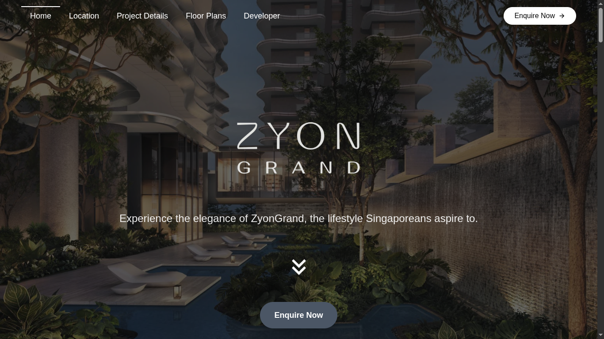
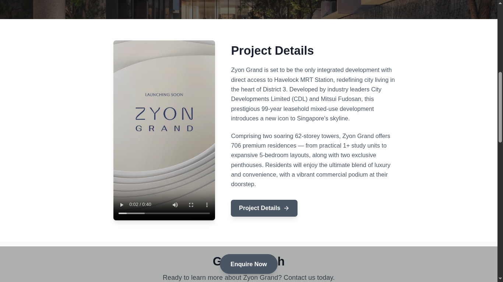
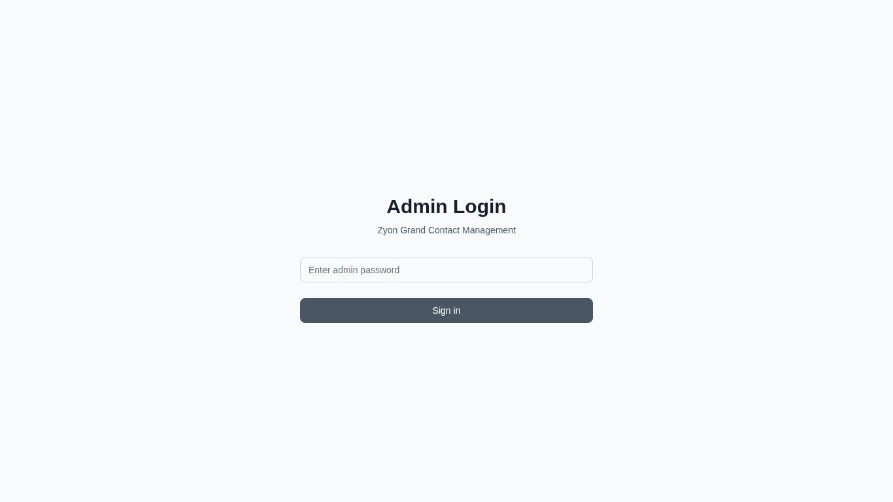
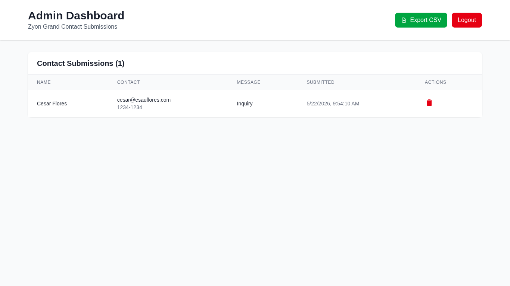
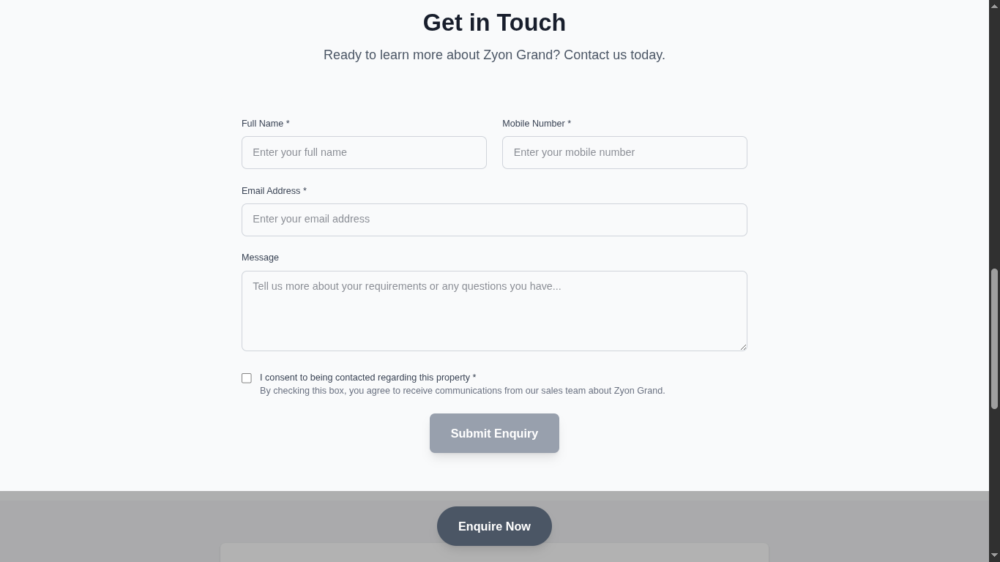

# Zyon Grand Landing

Landing page and content management system for Zyon Grand, a luxury property development. Built with Next.js, Prisma, and Tailwind CSS.

## Screenshots







## Tech Stack

- **Framework**: Next.js 15 (Turbopack)
- **Database**: PostgreSQL via Prisma ORM
- **Styling**: Tailwind CSS 4
- **Icons**: Iconify
- **Deploy**: Netlify

## Getting Started

```bash
pnpm install
pnpm run dev
```

## Scripts

| Command           | Description                     |
| ----------------- | ------------------------------- |
| `pnpm dev`        | Start dev server with Turbopack |
| `pnpm build`      | Production build                |
| `pnpm db:migrate` | Run Prisma migrations           |
| `pnpm db:studio`  | Open Prisma Studio              |
| `pnpm db:push`    | Push schema to database         |

## Docker

```bash
docker compose up
```

## Pages

- `/` — Landing page
- `/floor-plans` — Unit floor plans
- `/location` — Location and amenities
- `/project-details` — Project specifications
- `/developer` — Developer information
- `/admin` — Admin dashboard
